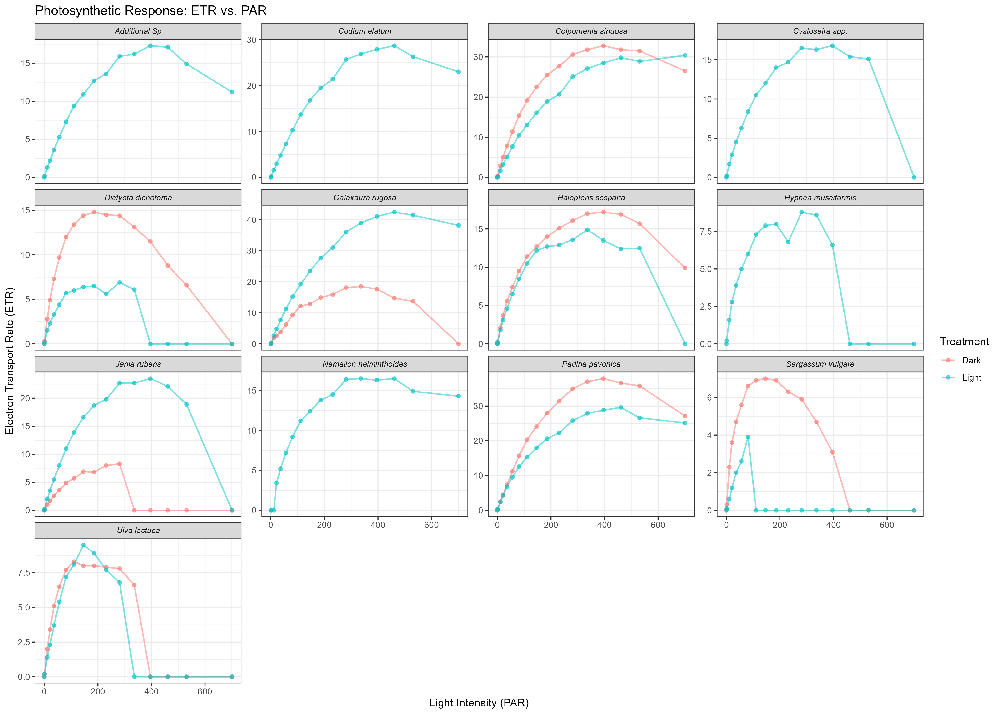
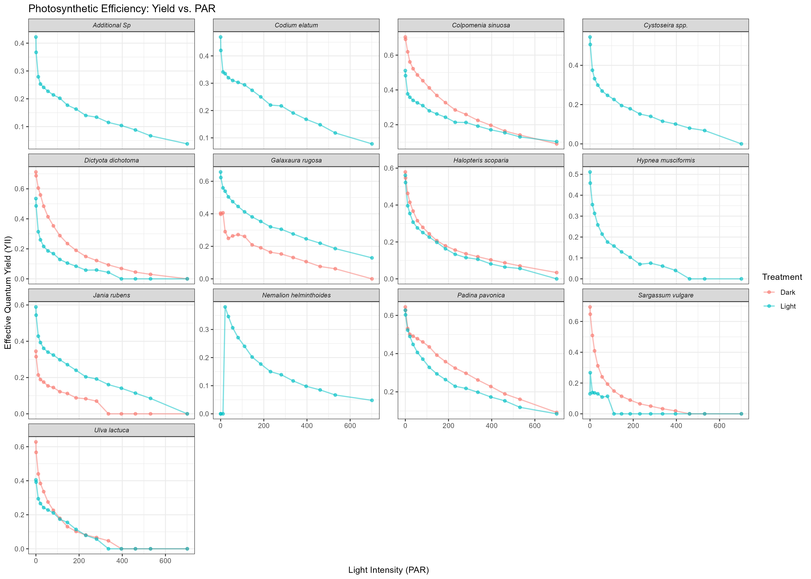
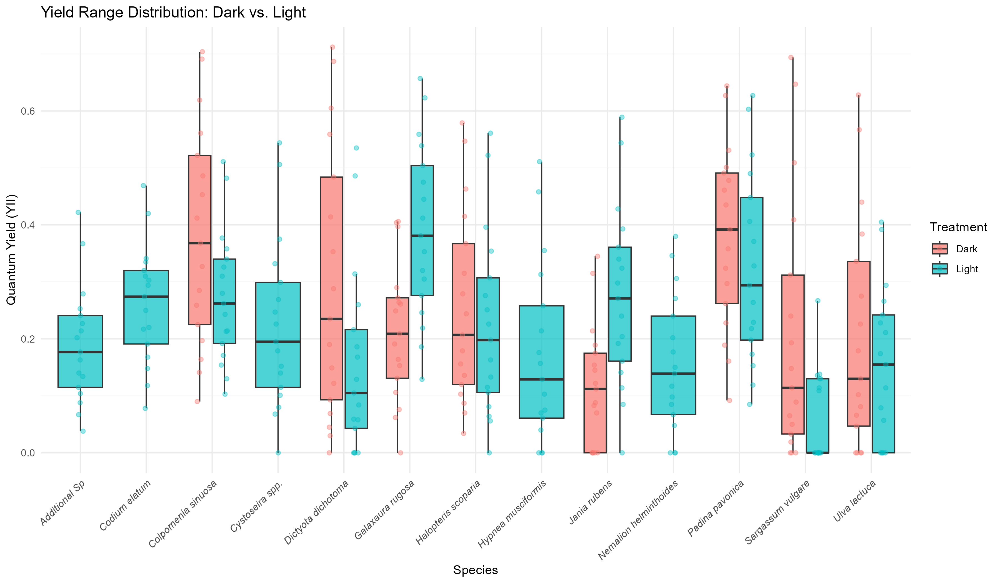

# Algae Photophysiology Analysis - Mediterranean Species (2026)

## Project Overview
This study evaluates the photosynthetic performance of 13 Israeli Mediterranean algae species under two physiological states: **Dark-adapted** and **Light-adapted**. Using Pulse Amplitude Modulation (PAM) fluorometry and Rapid Light Curves (RLC), we analyzed the Electron Transport Rate (ETR) and Quantum Yield (YII) to determine if short-term light exposure induces significant physiological shifts or photoinhibition.

---

## 1. Parameters and Units
The following parameters were extracted and analyzed. A detailed Excel version of this documentation is available in the `/data` directory.

| Parameter | Units | Description |
| :--- | :--- | :--- |
| **PAR** | $\mu mol\ photons\ m^{-2} s^{-1}$ | Photosynthetically Active Radiation (Light intensity). |
| **ETR** | $\mu mol\ electrons\ m^{-2} s^{-1}$ | Electron Transport Rate - measures the rate of photosynthesis. |
| **Y(II)** | Dimensionless (0-1) | Effective Quantum Yield of Photosystem II (Efficiency). |
| **Alpha ($\alpha$)** | $electrons / photons$ | Initial slope of the curve; represents light-harvesting efficiency. |
| **$P_{max}$** | $\mu mol\ electrons\ m^{-2} s^{-1}$ | Maximum Electron Transport Rate (Photosynthetic capacity). |
| **$I_k$** | $\mu mol\ photons\ m^{-2} s^{-1}$ | Light saturation point ($P_{max} / \alpha$). |

---

## 2. Materials and Methods

### Field Sampling and Site Description
Specimens were collected from the rocky intertidal zone of **Sdot-Yam, Israel**, along the eastern Mediterranean coast. To evaluate photo-adaptation strategies, algae were sampled from two distinct light micro-habitats:
1. **Sun-exposed:** Individuals growing on open horizontal surfaces, subject to direct and high intensity solar radiation.
2. **Shaded:** Individuals growing in deep crevices, under ledges, or in shaded vertical areas with no direct sunlight exposure.

### Photophysiological Measurements
Following collection, specimens were transported to the laboratory in ambient seawater and analyzed using an **Imaging PAM (iPAM, Walz, Germany)**. Rapid Light Curves (RLC) were generated for each individual. Each curve consisted of 17 incremental steps of Photosynthetically Active Radiation (PAR), ranging from 0 to approximately 700 µmol photons m⁻² s⁻¹. 
The measured parameters included:
* **Effective Quantum Yield (YII)**: The efficiency of energy conversion in Photosystem II.
* **Electron Transport Rate (ETR)**: Derived as $Y(II) \times PAR \times 0.5 \times 0.84$.

### Detailed Data Processing Workflow (R Script)
The raw data exported from the iPAM software was processed using a custom-built R pipeline (R Version 4.x) to ensure reproducibility and statistical integrity. The workflow involved the following technical stages:

1. **Automated Tidying:** Raw CSV files utilized a semicolon (;) delimiter. We used the `tidyr` package to transform the data from a **"Wide Format"** (where each sample occupied a separate column) into a **"Long Format" (Tidy Data)**. This was achieved using the `pivot_longer` function, allowing for unified operations across all species and treatments simultaneously.

2. **Heuristic Naming Correction:** Due to character encoding issues during CSV export, R automatically converted parentheses in parameter names to dots (e.g., `Y(II)` became `Y.II.`). We implemented a **Regular Expression (Regex)** filter to dynamically identify these patterns and standardized them back to their biological nomenclature using `case_when` logic, ensuring consistent filtering and labeling in visualizations.

3. **Algorithmic Parameter Extraction:**
   * **Alpha ($\alpha$):** Rather than using a single point, the initial slope of the RLC was calculated by applying a **Linear Regression Model (`lm`)** to the ETR values at low light intensities ($0 < PAR \leq 250$). This provides a more robust estimate of light-harvesting efficiency.
   * **$P_{max}$:** The photosynthetic capacity was programmatically identified as the absolute maximum ETR value achieved across the entire 17-point curve.
   * **$I_k$ (Saturation Point):** Calculated as the mathematical ratio $P_{max} / \alpha$.

### Statistical Analysis
Since each species was represented by a single individual ($N=1$), the species were treated as biological replicates to test the overall effect of light treatment. 
* **Paired T-tests** were performed on the extracted parameters ($P_{max}$ and Alpha) for $N=8$ complete species pairs.
* **Assumptions:** Normality was visually assessed using QQ-plots.

### Software and Reproducibility
* **R Version:** 4.3.1
* **RStudio Version** 2026.04.0+526 
* **Key Packages:** `dplyr`, `tidyr`, `ggplot2`, `rstatix`, `broom`, `purrr`.
* Full session information, including exact package versions, is documented in: [R_Session_Package_Versions.txt](./Output/R_Session_Package_Versions.txt).

---

## 3. Results

### Figure 1: Photosynthetic Capacity (ETR vs. PAR)

*Legend: Rapid Light Curves (RLC) showing the Electron Transport Rate (ETR) as a function of light intensity (PAR). Trends compare Dark-adapted (Red) vs. Light-adapted (Blue) states across 13 species. Most species exhibit standard saturation kinetics.*

### Figure 2: Photosynthetic Efficiency (Yield vs. PAR)

*Legend: Effective Quantum Yield (YII) as a function of PAR. This graph illustrates the progressive decline in efficiency as light intensity increases, indicating the dynamic downregulation of Photosystem II.*

### Figure 3: Yield Range Distribution

*Legend: Boxplots representing the distribution of Quantum Yield values across all PAR levels. This visualization highlights the inter-specific variability and the overall spread of physiological efficiency during the experiment.*

---

## 4. Interpretation and Conclusions

### Statistical Findings
The Paired T-test analysis revealed **no significant differences** between Dark and Light treatments for both photosynthetic capacity and efficiency:
* **Photosynthetic Capacity ($P_{max}$):** $t(7) = 0.502, p = 0.631$.
* **Light-harvesting Efficiency ($\alpha$):** $t(7) = -0.145, p = 0.889$.
* **Saturation Point ($I_k$):** Saturation levels remained consistent across treatments, reflecting stable metabolic thresholds.

### Conclusions

1. **Physiological Robustness:** The primary photosynthetic machinery of the tested Mediterranean algae is highly robust to short-term light adaptation. The stability of $P_{max}$ and Alpha indicates that the "Light" treatment did not fundamentally alter the primary energy-conversion capacity of the organisms.
  
2. **Dynamic Downregulation vs. Chronic Damage:** While a decline in Yield (YII) was observed as light intensity increased (Figure 2), the lack of a significant drop in $P_{max}$ suggests this was a **dynamic, reversible downregulation** rather than chronic photo-oxidative damage. This reflects an effective photoprotective strategy common in intertidal species.

3. **Interspecific Variability:** The non-significant group-level result is likely driven by high inter-specific variability. The wide range of responses seen in the Yield data (Figure 3) reflects the diverse ecological niches these species occupy, suggesting that species identity is a stronger predictor of photosynthetic performance than the specific adaptation treatment used in this trial.

4. **Limitations:** Given the sample size ($N=8$ complete species pairs), the study provides a robust overview of general trends, though subtle species-specific adaptations might require further replicates to achieve statistical significance.

---

## Repository Structure
* `/Raw_Data`: Raw CSV files.
* `/scripts`: Final R script for analysis and visualization.
* `/Output`: Processed CSV/Excel files, High-resolution graphs, statistical results, and R Environment.

