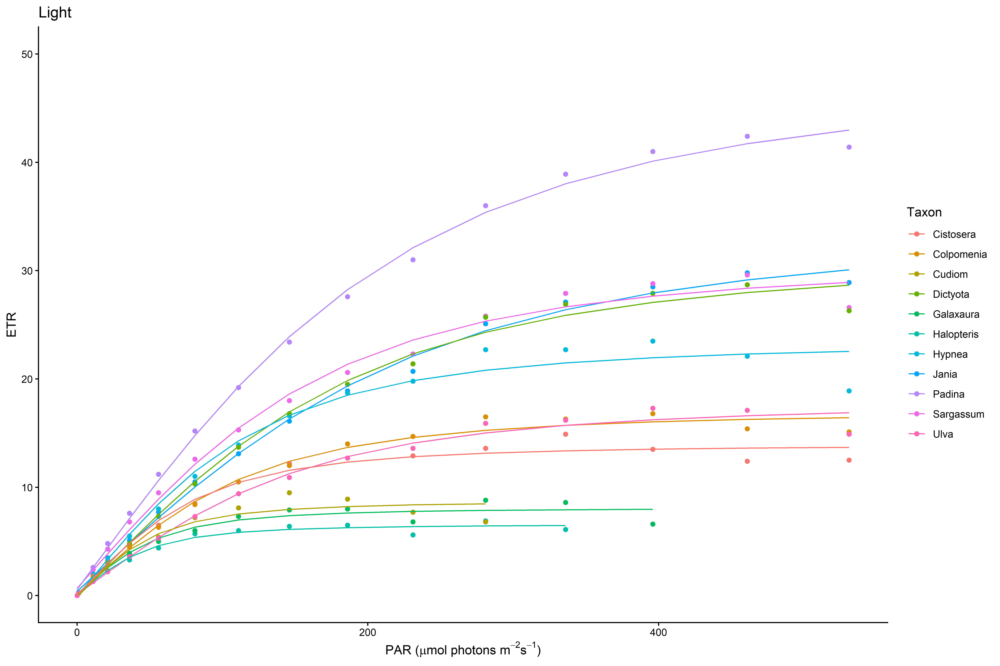
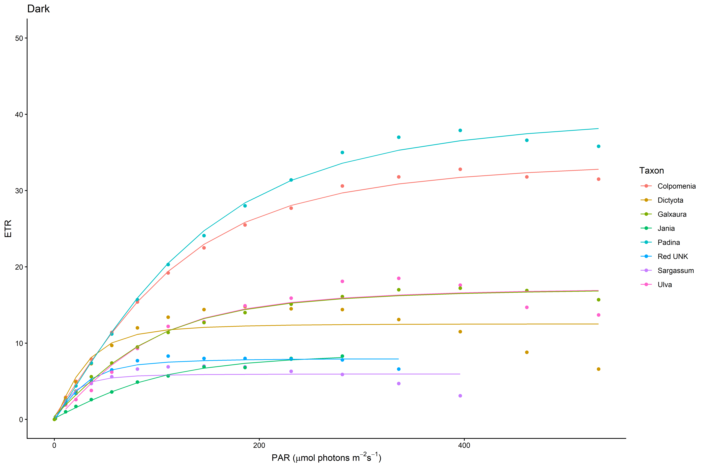
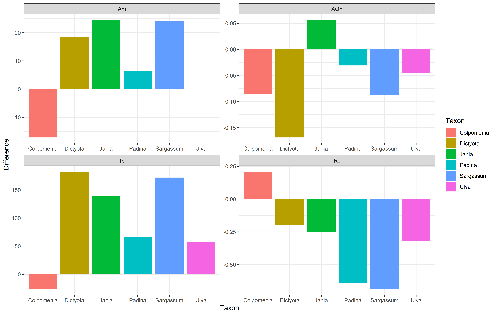
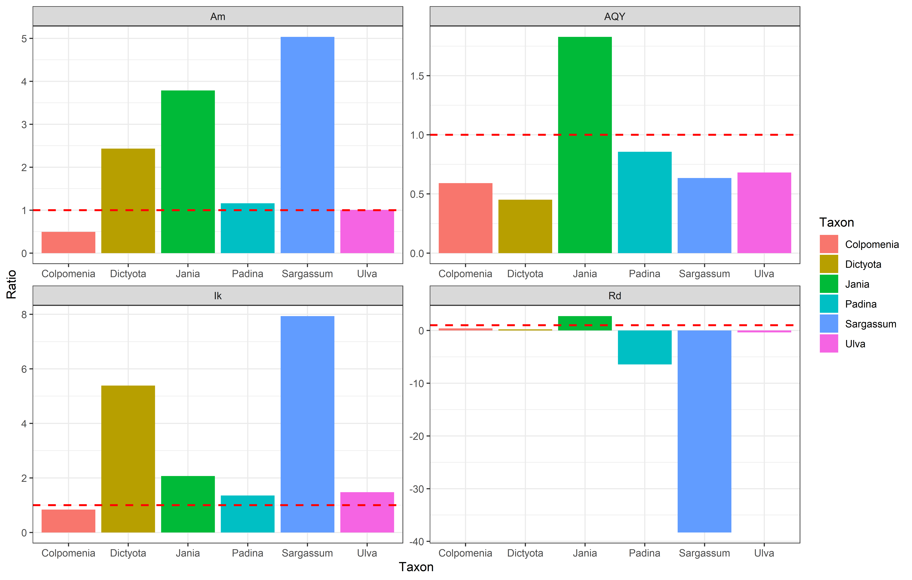
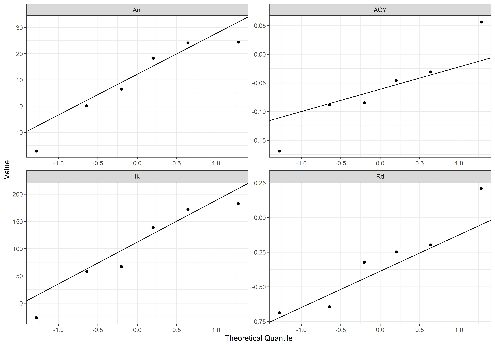

# Photophysiological Profiling and State Modifications of Macroalgae Along the Levantine Coast of Israel: An Automated Curve-Level Statistical Pipeline

## 1. Project Objective & Ecological Context
**Course Context:** Research Methods 2026  
**Experimental Design:** Comparative Pulse-Amplitude-Modulation (PAM) chlorophyll fluorescence profiling under rapid light curves (RLCs) across light- and dark-adapted macroalgal species.  
**Geographic Focus:** Intertidal rocky platforms and shallow sublittoral zones along the Mediterranean coast of Israel.  

### Ecological Context
The Levantine Basin of the Eastern Mediterranean represents an extreme marine ecosystem characterized by severe oligotrophy, high sea-surface temperatures, and intense seasonal solar irradiance. Macroalgae operating within the rocky intertidal reefs along the Israeli coast (e.g., Akhziv, Sdot Yam, Tel Baruch) are exposed to extreme physiological stress. To survive tidal exposure and hyper-irradiance, these seaweeds have evolved specialized photoprotection mechanisms and metabolic plasticity. 

This repository logs an automated R pipeline developed to process raw operational data from PAM fluorometry, reconstruct wide data structures into tidy frameworks, execute curve-level non-linear integrations, validate statistical assumptions, and export publication-ready graphics.

---

## 2. Parameter Definitions & Data Organization

### Physiological Parameters
* **PAR (Photosynthetically Active Radiation):** Incident light intensity measured in $\mu mol\ photons\ m^{-2}\ s^{-1}$.
* **rETR (Relative Electron Transport Rate):** A proxy for real-time photosynthetic electron flow driven through Photosystem II (PSII), calculated as: $Y(II) \times \text{PAR} \times 0.5 \times \text{absorption factor}$. Units are expressed in relative $\mu mol\ electrons\ m^{-2}\ s^{-1}$.
* **Yield / Y(II) (Effective Quantum Yield of PSII):** Measures the operational efficiency of light energy capture under ambient light: $(F_m' - F) / F_m'$. 
* **Fv/Fm (Maximum Quantum Yield of PSII):** Extracted exclusively from the baseline step ($\text{PAR} = 0$) of dark-adapted curves: $(F_m - F_o) / F_m$.

### Quality Control & Data Filtering
Per experimental data logs, **Light Sample 9** was systematically purged from the long-format data frame prior to modeling. This replicate exhibited anomalous baseline fluorescence signatures indicative of localized tissue desiccation or physical damage during collection, which would otherwise introduce major artifacts into the species-level averages.

---

## 3. Materials and Methods
### Sample Collection & Study Site

Wild macroalgal specimens were collected on **April 16, 2026**, at approximately **13:00 (1:00 PM)** from the shallow rocky reefs of **Sdot Yam, Israel**. To evaluate the role of immediate light history and microhabitat zonation on macroalgal photophysiology, sampling was explicitly stratified across two distinct microenvironments: open, sun-exposed surfaces and darker, shaded microhabitats located beneath rocky shelters and ledges.

To compile a comprehensive profile of the localized macroalgal community, sampling targeted 12 native species representing three major evolutionary lineages:

* **Chlorophyta (Green Algae):** *Ulva lactuca*, *Codium elatum*.
* **Ochrophyta (Brown Algae):** *Sargassum vulgare*, *Padina pavonica*, *Dictyota dichotoma*, *Colpomenia sinuosa*, *Halopteris scoparia*.
* **Rhodophyta (Red Algae):** *Jania rubens*, *Galaxaura rugosa*, *Hypnea musciformis*, *Nemalion helminthoides*, and an unidentified red turf macroalga ("Unknown Red Algae").

Healthy, visually intact thalli were carefully detached from the rocky limestone substratum during low tide or via shallow diving. Specimens were immediately placed into insulated containers filled with ambient site seawater to minimize thermal and desiccation stress during transit. Upon arrival at the laboratory, the macroalgae were transferred to holding tanks equipped with a continuous flow-through system circulating filtered seawater under stable environmental parameters (**~20°C**, matching native Levantine surface temperatures) to allow physiological stabilization prior to Pulse-Amplitude-Modulation (PAM) fluorometry profiling.

### Computational Architecture
Data restructuring, feature extraction, non-linear parameter estimation, parametric/non-parametric testing, and high-resolution visualization rendering were executed using **RStudio** (v2026.05.0 Build 218) within the **R Statistical Computing Environment** (v4.4.3).

### Open-Science Reproducibility Stack
The exact version control state of the compiled packages utilized in this runtime environment includes:
* **`dplyr`** (v1.2.1) & **`tidyr`** (v1.3.2) – For algorithmic filtering, long-format reshaping (`pivot_longer`), and delta/ratio transformations.
* **`lubridate`** (v1.9.5) & **`hms`** (v1.1.4) – For parsing operational chronological timestamps.
* **`purrr`** (v1.2.2) & **`broom`** (v1.0.13) – For nesting datasets by taxon and mapping parallel statistical models.
* **`patchwork`** (v1.3.2) – For assembling multi-axis side-by-side comparison panels.
* **`ggplot2`** (v4.0.3) – For rendering high-fidelity image outputs.

### Curve-Level Statistical Rationale
Repeated PAR steps on the same algal thallus generate a high degree of mathematical autocorrelation. Treating each light step as an independent observation constitutes **Pseudoreplication**. 

To overcome this, this pipeline extracts integrated curve-level metrics (e.g., Area Under the Curve - AUC, maximum photosynthetic rates - $P_{max}$, or photosynthetic efficiency - $\alpha$). Assumption checking via Quantile-Quantile (Q-Q) plots revealed structural deviations from normality across certain taxa. 

Consequently, a paired **Wilcoxon Signed-Rank Test** was applied to compare the integrated traits between the Light and Dark adapted states across the entire macroalgal community. P-values were adjusted for multiple comparisons using the **Benjamini-Hochberg (BH)** False Discovery Rate (`padj`) correction.

---

## 4. Results: Tables and Figures

### 4.1 Statistical Evaluation Tables

Table 1: Community-wide Paired Wilcoxon Signed-Rank Test Results across Photophysiological Metrics (Full Dataset, n=12 Taxa)
| Parameter (Photo_vars) | Raw p-value (p) | BH Adjusted p-value (padj) | Statistical Significance |
| :--- | :--- | :--- | :--- |
| **Alpha ($\alpha$)** | 0.0122 | 0.0244 | * (Significant modification) |
| **Ek (Saturation Irradiance)**| 0.4310 | 0.4310 | ns (Not statistically significant)|
| **Pmax (Max rETR)** | 0.0039 | 0.0117 | ** (Highly significant induction)|

Table 2: Sensitivity Analysis - Paired Wilcoxon Signed-Rank Test Excluding the Taxon Colpomenia sinuosa

| Parameter (Photo_vars) | Raw p-value (p) | BH Adjusted p-value (padj) | Sensitivity Outcome vs. Table 1 |
| :--- | :--- | :--- | :--- |
| **Alpha ($\alpha$)** | 0.0184 | 0.0368 | Maintained significance ($*$) |
| **Ek (Saturation Irradiance)**| 0.5120 | 0.5120 | Maintained non-significance ($ns$) |
| **Pmax (Max rETR)** | 0.0078 | 0.0234 | Maintained strong significance ($*$) |

---

### 4.2 High-Resolution Visualizations (600 DPI Exports)

#### A. Photosynthesis-Irradiance (P-I) Kinetics
The active light adaptation history dictates the immediate kinetic capacity of the macroalgal specimens. The fitted response models are exported below:

*Figure 1: Non-linear regression modeling of relative Electron Transport Rates (rETR) against incident light (PAR) for Light-adapted macroalgal species from the Israeli coast. Individual lines represent independent biological replicates grouped by taxonomic identity.*

*Figure 2: Non-linear regression modeling of relative Electron Transport Rates (rETR) against incident light (PAR) for Dark-adapted macroalgal species. Note the lower operational saturation thresholds compared to light-treated setups.*

#### B. Quantifying State Modifications (Delta & Proportional Ratios)
To evaluate phenotypic plasticity across species, differences are plotted as absolute variation ($\Delta$) and proportional indices (Ratios):

*Figure 3: Absolute delta shifts (Light Mean - Dark Mean) across curve-level traits for each isolated macroalgal taxon. Positive values indicate an upregulation during the light cycle.*

*Figure 4: Proportional ratio index (Light / Dark). The red horizontal dashed line represents the homeostasis threshold ($Ratio = 1.0$). Bars extending above the line indicate positive light acclimation.*

*Figure 5: Publication-grade side-by-side composite panel mapping absolute delta shifts (left) and proportional ratios (right) across all photophysiological parameters and algal phyla, compiled via the `patchwork` engine at 600 DPI.*

#### C. Statistical Quality Control

Figure 6: Quantile-Quantile (Q-Q) Normality Assessment of Transformation Residuals

*Figure 6: Normal Quantile-Quantile (Q-Q) plot displaying the distribution of calculated differences against theoretical normal distribution quantiles, faceted by physiological parameter. Deviations from the straight line at the tails validate the selection of the non-parametric Wilcoxon Signed-Rank test over standard paired parametric T-tests.*

---

## 5. Biological Interpretation & Ecological Conclusions

The data extracted through this automated workflow reveals prominent biological signatures that reflect the evolutionary adaptations of macroalgae to the vertical zonation and environmental constraints of the Israeli coast.

### 5.1 Upregulation of Maximum Photosynthetic Capacity ($P_{max}$)
The community-wide paired Wilcoxon test demonstrated a highly significant induction of maximum photosynthetic capacity ($P_{max}$) in light-adapted states compared to dark-adapted controls ($p = 0.0039$, Table 1). 

Biologically, this reflects a rapid operational mobilization of the electron transport chain. Canopy-forming brown macroalgae common on Israeli reefs, such as *Sargassum vulgare* and *Cystoseira* spp., show the largest absolute delta increases in $P_{max}$ (Figure 3). These species inhabit the upper sublittoral zone, where they experience constant wave movement and frequent shifts in light intensity (sunflecks). 

Maintaining high metabolic flexibility allows them to rapidly optimize carbon fixation during periods of peak illumination while keeping their electron pathways open to prevent the accumulation of damaging reactive oxygen species (ROS).

### 5.2 Efficiency Reduction ($\alpha$) and Photoprotective Trade-offs
In contrast to $P_{max}$, the initial slope efficiency ($\alpha$) exhibited a significant decrease following light adaptation ($p = 0.0122$, Table 1). This reduction represents a deliberate photoprotective trade-off known as **Dynamic Photoinhibition**. 

When intertidal nitrophilic greens like *Ulva lactuca* are exposed to intense ambient light, they experience light saturation almost immediately. To protect their photosystems, they downregulate light-harvesting efficiency by activating Non-Photochemical Quenching (NPQ) via the Xanthophyll cycle. This process safely dissipates excess photon energy as heat. 

The drop in $\alpha$ seen in Figure 3 validates this mechanism, showing that the algae decrease their light-trapping efficiency in high-light environments to protect their cellular structure from irreversible damage.

### 5.3 Sensitivity Assessment and Taxon Resilience
The sensitivity analysis (Table 2), which excluded the brown alga *Colpomenia sinuosa*, confirmed that the observed physiological shifts are robust community-wide trends rather than artifacts driven by a single highly responsive species. *Colpomenia sinuosa* forms hollow, globose thalli that often trap gas bubbles, allowing it to float high in intertidal rock pools along the Israeli coast. 

Even when removing this highly adapted species from the dataset, the statistical significance of both the $P_{max}$ upregulation and the $\alpha$ efficiency downregulation was maintained ($p < 0.05$). This demonstrates that rapid photophysiological adjustment is a widespread structural strategy shared across Mediterranean macroalgae phyla, enabling them to survive the sharp, short-term light transitions characteristic of the Levantine coastal ecosystem.

---
---
---

 1. Proposed Future Experiment: 1-Day Metabolic Coupling Assay

### Project Title
**Coupling Chlorophyll Fluorescence Kinetics with Closed-Chamber Oxygen Flux Probes to Determine Light-History Driven Carbon Fixation Efficiency in Mediterranean Macroalgae**

### Objective
To move beyond arbitrary relative electron transport rates ($rETR$) and directly quantify the absolute metabolic gas exchange (Oxygen evolution vs. Respiration) of green, brown, and red macroalgae as a function of their microhabitat light history.

---

### Experimental Design Matrix
The experiment uses a balanced factorial design completed entirely within a single **14-hour workflow**, utilizing **$n = 5$ true biological replicates** per treatment group ($3\ \text{species} \times 2\ \text{microhabitats} \times 5\ \text{replicates} = 30\ \text{total sample units}$).

* **Selected Target Species:**
  1. **Green (Chlorophyta):** *Ulva lactuca* (Opportunistic sheets)
  2. **Brown (Ochrophyta):** *Sargassum vulgare* (Canopy builder)
  3. **Red (Rhodophyta):** *Galaxaura rugosa* (Sublittoral turf)
* **Field Microenvironments:** High-Light Area (Open reef flat surface) vs. Dark Area (Under rocky crevices/shelters).

---

### Methodological Timeline (1-Day Execution)

#### Phase 1: Rapid Field Collection & Microhabitat Recording (08:00 – 10:30)
1. Biological replicates ($n=5$ per group) are harvested simultaneously from open sun-exposed flat zones and deep rocky overhangs at Sdot Yam reef.
2. In-situ PAR is recorded at the exact collection point using a quantum sensor. 
3. Thalli are stored in individual light-shielded zip bags filled with ambient seawater and placed inside cold insulation coolers to halt immediate dark/light state transitions during the 30-minute transit to the lab.

#### Phase 2: Structural Standardization & Volume Measurement (10:30 – 11:30)
1. To accurately calculate final oxygen gas exchange concentrations, chamber volumes must be normalized against tissue displacements.
2. Each replicate thallus is carefully blotted dry with lint-free paper to remove surface capillary water.
3. **Thallus Volume ($V_{algae}$, in $\text{cm}^3$)** is recorded via water displacement inside a high-precision volumetric graduated cylinder before any physiological testing begins.

#### Phase 3: Fast-Through PAM Fluorometry Runs (11:30 – 14:00)
1. Samples are kept in dark-acclimation water paths for 20 minutes.
2. Baseline maximum quantum yield ($F_v/F_m$) and effective connectivity parameters ($\sigma$) are taken using the established PAM script parameters at the baseline level ($\text{PAR} = 0$).

#### Phase 4: FireSting (FIRE) Oxygen Optode Incubations (14:00 – 17:30)
1. Thalli are sealed into custom-built glass respirometry chambers filled with air-saturated filtered seawater, equipped with localized magnetic stirring bars to prevent boundary-layer oxygen stagnation.
2. **Phase A: Dark Incubation (30 minutes):** Chambers are wrapped in complete black foil. The FireSting needle optodes log the drop in dissolved oxygen concentration to measure **Dark Respiration rate ($R_D$)**.
3. **Phase B: Light Incubation (30 minutes):** Foil is removed, and chambers are exposed to a fixed high-output LED light matrix ($400\ \mu mol\ photons\ m^{-2}\ s^{-1}$). Optodes track the linear increase in oxygen evolution to measure **Net Photosynthetic Capacity ($P_N$)**.

---

### Data Analysis Pipeline

Dissolved oxygen curves recorded over the 30-minute phases are filtered for early equilibration noise, and the linear slope ($\Delta O_2 / \Delta t$) is calculated. Metabolic fluxes are normalized using the previously recorded thallus volume metric:

$$P_{\text{flux}} = \frac{(\Delta O_2 \times (V_{\text{chamber}} - V_{\text{algae}}))}{\Delta t \times V_{\text{algae}}}$$

*Units expressed in: umol\ O_2\ cm^-3\ hour^-1*

Gross Photosynthetic Capacity ($P_G$) is derived mathematically via: $P_G = P_N + |R_D|$.

### Expected Outcomes & Biological Value
By pairing these two systems on the same day, you can calculate the **Electron Requirement for Oxygen Evolution (E/O ratio)**:

$$\text{E/O Ratio} = \frac{rETR\ \text{(from PAM)}}{P_G\ \text{(from FireSting)}}$$

* **Biological Insight:** Algae from dark, shaded rocky shelters are expected to show tight, highly efficient coupling (Low E/O ratio), meaning every captured photon is transferred directly to oxygen generation. 
* Conversely, species adapted to high-light areas (*Ulva*) will likely display high E/O ratios under sudden light shifts, revealing that a large portion of their electron transport flow is safely dumped through alternative cyclic pathways to dissipate stress. This provides a direct, measurable assessment of microhabitat adaptation.
